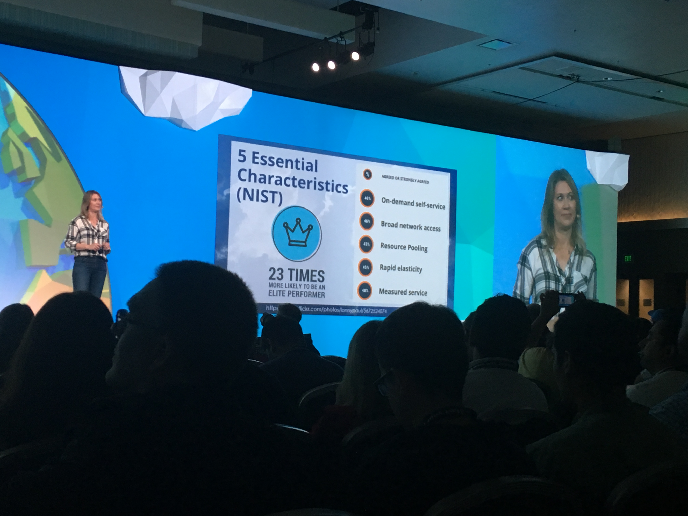
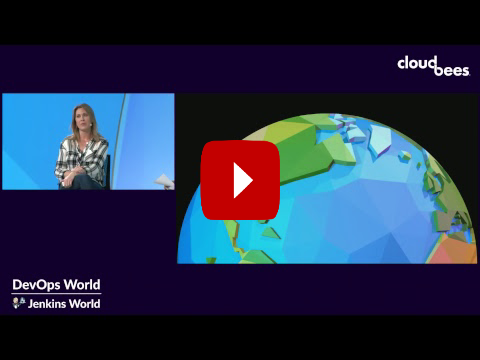

# DevOps/Jenkins World 2018

### https://devopsworldjenkinsworld2018.sched.com
[@devopsworldconf](https://twitter.com/devopsworldconf)

<!-- .slide: data-transition="zoom" -->

---
#### workshop: cloudbees core
[github/cloudbees-cd-acceleration-workshop](https://github.com/cloudbees-cd-acceleration-workshop/cloudbees-cd-acceleration-workshop-exercises)
[github/kayla-cb-ws](https://github.com/kayla-cb-ws)


was Jenkins Enterprise 1.x now Cloudbees Core
https://go.cloudbees.com/downloads/
https://www.cloudbees.com/products/cloudbees-core
<!-- .slide: data-transition="convex" -->
---
#### custom marker file
https://github.com/kayla-cb-ws/helloworld-nodejs
```text
.node-app
```
https://github.com/kayla-cb-ws/custom-marker-pipelines
```text
nodejs-app
└── Jenkinsfile.template
```
* Can be any file, can contain properties.
* can be any file, even an app file like pom.xml
* can be ordered list, e.g. .node-app or Jenkinsfile
 
[custom-marker-files-setup](https://github.com/cloudbees-cd-acceleration-workshop/cloudbees-cd-acceleration-workshop-exercises/blob/master/exercises/intro-pipeline-cb-core.md#project-recognizers-with-custom-marker-files)
<!-- .slide: data-transition="convex" -->
---
#### stash/unstash
* very useful for multi-agent builds
* introduces a lot of network I/O to master
* pluggable storage like https://github.com/jenkinsci/artifact-manager-s3-plugin really helps performance
* enables restarting from stages (with preserveStashes)

 [approvals-artifacts-cb-core.md#stash-and-unstash](https://github.com/cloudbees-cd-acceleration-workshop/cloudbees-cd-acceleration-workshop-exercises/blob/master/exercises/approvals-artifacts-cb-core.md#stash-and-unstash)
<!-- .slide: data-transition="convex" -->
---
#### parallel vs. sequential stages
> We are duplicating the agent section and the post sections for capturing test results with the junit step. We are also executing the nodejs steps twice. That doesn't seem efficient - but it is because the parallel block for Declarative syntax does not allow you to define an agent section and a parallel block at the same level. More specifically, you can have ONLY ONE of either agent, parallel or stages as a child of the stage directive.

--
> What we really want to do in the Test stage is set-up the helloworld-nodejs just once - to incluce only running one Kubernetes Pod. We want to define the agent once for the entire Test stage, and then run the nodejs container block once but in the same workspace as what will be used by the testcafe containers. And we want to capture all of the test results. Unfortunatley this is not possible with Delcarative syntax - but it would be possible with scripted syntax.
--

* parallel can be slower, I/O bottlenecks
* parallel only works with separate containers
* if done correctly parallel can improve performance
* declartive is limited with parallel

https://github.com/cloudbees-cd-acceleration-workshop/cloudbees-cd-acceleration-workshop-exercises/blob/master/exercises/parallel-sequential-cb-core.md
<!-- .slide: data-transition="convex" -->
---
#### shared libraries
```groovy
// vars/defineProps.groovy
def call(String file, Map defaults) {
  //use the Pipeline Utility Steps plugin readProperties step to read the file
  def props = readProperties defaults: defaults, file: file
  for ( e in props ) {
    env.setProperty(e.key, e.value)
  }
}
```
The first comment may serve a purpose
--
```html
<h2>defineProps step</h2>
<p>
A custom step for using the <pre>readProperties</pre> step from the Pipeline Utilities plugin specifically from a Declarative Pipeline. 
</p>
<h3>Configuration</h3>
<dl>
	<dt>name</dt>
	<dd><pre>String</pre><b>REQUIRED</b> the file, including path, to be read from the workspace as the properties file</dd>
	<dt>defaults</dt>
	<dd><pre>Map</pre><b>OPTIONAL</b> default values for passed in properties file</dd>
</dl>

<h3>Example:</h3>
<pre>
	defineProps('.nodejs-app', [npmPackages: 'express pug'])
</pre>
```
provides documentation to the syntax generators
--
syntax matters

branch override
```groovy
library 'cd-accel@completed'
library 'cd-accel'
```
import everything
```groovy
@Library('cd-accel') _
```
--
* wildcard is expensive. it will load entire repo everytime
* wildcard breaks replay
* no wildcard with explicit imports is light

https://github.com/cloudbees-cd-acceleration-workshop/cloudbees-cd-acceleration-workshop-exercises/blob/master/exercises/advanced-pipeline-cb-core.md#pipeline-shared-libraries
<!-- .slide: data-transition="convex" -->
---
#### custom listeners
```groovy
triggers {
    eventTrigger simpleMatch('hello-api-push-event')
}
```
event listens for a job/event to fire

[advanced-pipeline-cb-core.md#cross-team-collaboration](https://github.com/cloudbees-cd-acceleration-workshop/cloudbees-cd-acceleration-workshop-exercises/blob/master/exercises/advanced-pipeline-cb-core.md#cross-team-collaboration)

https://go.cloudbees.com/docs/cloudbees-core/cloud-admin-guide/cross-team-collaboration/

<!-- .slide: data-transition="convex" -->
---
## takeaways
* enterprise: cloudbees support, os: optional support hours
* master node is wrapped with teams management
* multi masters becomes easy, way of life
* masters are provisioned as code with templates
* supports custom marker files
* teams can use provided and/or override when ready
* event listeners can trigger jobs across entire team cluster

<!-- .slide: data-transition="convex" -->
---

###### 5 Essential Characteristics (NIST)


<!-- .slide: data-transition="convex" -->

---

## Dr. Nicole Forsgren Keynote
[](https://www.youtube-nocookie.com/embed/R9izKUqPCiU?start=1019 "Devops/JenkinsWorld Closing Keynote")
---
